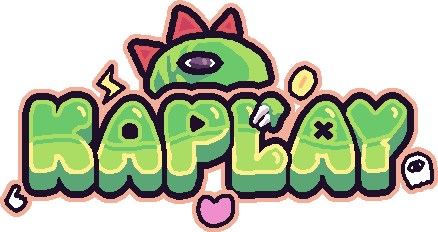

# 🎮 KAPLAY.js — A JavaScript & TypeScript Game Library

<div align="center">
  
</div>

KAPLAY is the **fun-first**, 2D game library for **JavaScript** and
**TypeScript**. It’s made to **feel like a game** while you're making games.
Simple. Fast. Powerful.

✨ Whether you’re a beginner or an experienced dev, **KAPLAY** comes with its
own **web-based editor** — the [KAPLAYGROUND](https://play.kaplayjs.com) — so
you can try code instantly, and learn with more than **90 examples**!

## 🎲 Quick Overview

```js
// Start a game
kaplay({
    background: "#6d80fa",
});

// Load an image
loadSprite("bean", "https://play.kaplayjs.com/bean.png");

// Add a sprite to the scene
add([
    sprite("bean"), // it renders as a sprite
]);
```

Game objects are composed from simple, powerful components:

```js
// Add a Game Obj to the scene from a list of component
const player = add([
    rect(40, 40), // it renders as a rectangle
    pos(100, 200), // it has a position (coordinates)
    area(), // it has a collider
    body(), // it is a physical body which will respond to physics
    health(8), // it has 8 health points
    // Give it tags for easier group behaviors
    "friendly",
    // Give plain objects fields for associated data
    {
        dir: vec2(-1, 0),
        dead: false,
        speed: 240,
    },
]);
```

Blocky imperative syntax for describing behaviors

```js
// .onCollide() comes from "area" component
player.onCollide("enemy", () => {
    // .hurt() comes from "health" component
    player.hurt(1);
});

// check fall death
player.onUpdate(() => {
    if (player.pos.y >= height()) {
        destroy(player);
    }
});

// All objects with tag "enemy" will move to the left
onUpdate("enemy", (enemy) => {
    enemy.move(-400, 0);
});

// move up 100 pixels per second every frame when "w" key is held down
onKeyDown("w", () => {
    player.move(0, 100);
});
```

## 🖥️ Installation

### 🚀 Using `create-kaplay`

The fastest way to get started:

```sh
npx create-kaplay my-game
```

Then open [http://localhost:5173](http://localhost:5173) and edit `src/game.js`.

### 📦 Install with package manager

```sh
npm install kaplay
```

```sh
yarn add kaplay
```

```sh
pnpm add kaplay
```

```sh
bun add kaplay
```

> You will need a bundler like [Vite](https://vitejs.dev/) or
> [ESBuild](https://esbuild.github.io/) to use KAPLAY in your project. Learn how
> to setup ESbuild
> [here](https://kaplayjs.com/guides/install/#setup-your-own-nodejs-environment).

### 🌐 Use in Browser

Include via CDN:

```html
<script src="https://unpkg.com/kaplay@3001.0.12/dist/kaplay.js"></script>
```

### 📜 TypeScript Global Types

If you're using **TypeScript**, you used `create-kaplay` or installed with a
package manager and you want **global types**, you can load them using the
following directive:

```ts
import "kaplay/global";

vec2(10, 10); // typed!
```

But it's recommended to use `tsconfig.json` to include the types:

```json
{
  "compilerOptions": {
    "types": ["./node_modules/kaplay/dist/declaration/global.d.ts"]
  }
}
```

> If you are publishing a game (and not testing/learning) maybe you don't want
> to use globals,
> [see why](https://kaplayjs.com/guides/optimization/#avoid-global-namespace).

You can also use all **KAPLAY** source types importing them:

```js
import type { TextCompOpt } from "kaplay"
import type * as KA from "kaplay" // if you prefer a namespace-like import

interface MyTextCompOpt extends KA.TextCompOpt {
  fallback: string;
}
```

## 📚 Resources

### 📖 Docs

- [KAPLAY Official Docs](https://kaplayjs.com/docs/)
- [KAPLAYGROUND](https://play.kaplayjs.com)

### 📺 Tutorials

- 🎥
  [KAPLAY Library Crash Course by JSLegend ⚔️](https://www.youtube.com/watch?v=FdEYxGoy5_c)
- 📖
  [Learn JavaScript basics and KAPLAY to make games quickly](https://jslegenddev.substack.com/p/learn-the-basics-of-javascript-and)

### 💬 Community

- [Discord Server](https://discord.gg/aQ6RuQm3TF)
- [GitHub Discussions](https://github.com/kaplayjs/kaplay/discussions)
- [Twitter](https://twitter.com/Kaboomjs)

## 🎮 Games

Collections of games made with KAPLAY, selected by KAPLAY:

- [Itch.io](https://itch.io/c/4494863/kag-collection)
- [Newgrounds.com](https://www.newgrounds.com/playlist/379920/kaplay-games)

## 🙌 Credits

KAPLAY is an open-source project, maintained by the
[KAPLAY Team and core contributors](https://github.com/kaplayjs/kaplay/wiki/Development-Team)
and with the support of many
[other amazing contributors](https://github.com/kaplayjs/kaplay/graphs/contributors).

### 🏆 Recognitions

- Thanks to [mulfok](https://twitter.com/MulfoK) for the awesome
  [mulfok32](https://lospec.com/palette-list/mulfok32) color palette, used in
  KAPLAY sprites and art
- Thanks to [Pixabay](https://pixabay.com/users/pixabay-1/) for the great
  [burp](https://pixabay.com/sound-effects/burp-104984/) sound, used in `burp()`
  function
- Thanks to [Kenney](https://kenney.nl/) for all used assets for examples
  - [Impact Sound Pack](https://kenney.nl/assets/impact-sounds)
  - [1-Bit Platformer Pack](https://kenney.nl/assets/1-bit-platformer-pack)
- Thanks to [abrudz](https://github.com/abrudz) for the amazing
  [APL386 font](https://abrudz.github.io/APL386/)
- Thanks to [Polyducks](http://polyducks.co.uk/) for the amazing
  [kitchen sink font](https://polyducks.itch.io/kitchen-sink-textmode-font) font
- Thanks to [0x72](https://0x72.itch.io/) for the amazing
  [Dungeon Tileset](https://0x72.itch.io/dungeontileset-ii)
